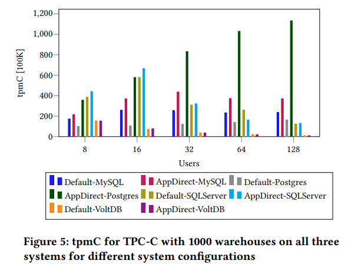
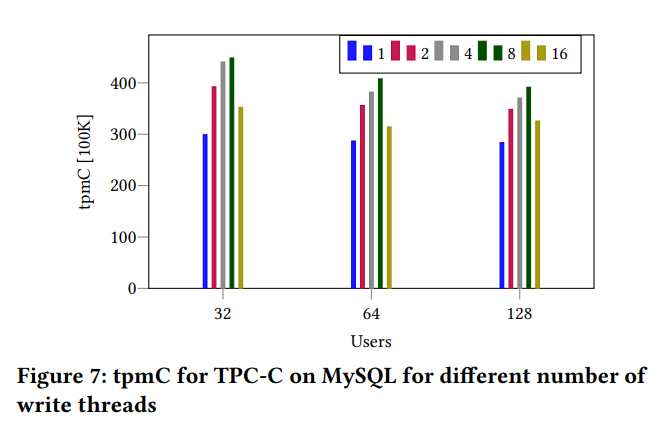

# NVM: Is it Not Very Meaningful for Databases?

> VLDB 2023

持久性或非易失性存储器(NVM)提供了扩展的存储容量和更快的持久性存储访问。
然而,目前还没有对不同NVM模式下现有的数据库引擎进行全面的实证分析,以了解数据库如何从各种硬件配置中受益。
为此,我们在AppDirect模式和内存模式下使用NVM在共同基准下分析了多个不同的引擎。
我们的结果表明,尽管易失性存储器容量更大,但内存模式下的NVM并没有提供任何明显的性能优势。
此外,使用NVM作为持久存储通常会加快查询执行,但有一些注意事项,因为I/O路径没有完全优化,因此并不总是能够证明额外的成本是合理的。
我们通过对不同工作负载下不同引擎和数据库配置的综合评估证明了这一点.

---
layout: two-cols
---

- 每个内存通道都通过集成的内存控制器(iMC)连接到CPU, iMC维护NVM DIRECT的读/写队列,并确保断电时的持久性
- NVM的内部访问粒度为256字节,顺序存取模式具有最高的带宽,仅比DRAM低2-3倍
- NVM在三种模式下运行: 内存模式, AppDirect模式, 混合模式
- 传统系统使用操作系统页面缓存、预取和直接内存访问(DMA)操作来优化IO：
  - 操作系统页面缓存会缓存最近从磁盘访问的数据。用户级程序通过`read(2)`和`write(2)`等系统调用访问页面缓存。
  - 页面缓存使用预取等技术来进一步改进I/O。
  - DMA允许数据在外围设备(如网络或存储设备)和内存之间传输而不通过CPU。DMA操作直接在外围设备和内存之间传输数据，完全绕过CPU和页面缓存。
- AppDirect模式和传统系统的差别：
  1. 在传统的系统中，操作系统页面缓存和预取被用来提高I/O操作的性能。在AppDirect模式下，页面缓存不可用，应用程序直接使用`mmap(2)`建立到持久内存的映射。
  2. NVM不是外围设备，因此DMA不可用，CPU必须参与NVM和CPU之间的每次数据传输。
  3. 尽管NVM有自己的预取器，但它不能使用OS页缓存来获得额外的内存容量，它必须直接依赖于应用程序分配的内存。

::right::

---
layout: two-cols
---

## 测试环境

## 读写延迟

::right::

## 读写带宽

- Default模式：使用SSD
- Memory模式：全部nvm都当作内存
- AppDirect模式：`fsdax`挂载nvm，不使用SSD

---

## TPC-H测试(SF=100)

---

## TPC-H测试PG的写/读带宽

---

## 结论(关于OLAP)

- 对于一般的OLAP工作负载：
  - 内存模式并没有提供显著的性能优势
  - 如果查询是I/O密集型且有足够的系统资源，则AppDirect模式可以显著加快工作负载执行
  - 如果系统资源有限或者查询是CPU密集型的，SSD由于价格便宜更有竞争力
- 对于使用顺序扫描：
  - AppDirect模式在非CPU密集型查询时非常有益。
  - 当大部分数据必须被大量处理时，AppDirect模式中缺少页面缓存和预取会降低NVM的大部分优势
  - 当DBMS执行随机扫描时，用户应该将块大小调大(≥ 8KB)，这样NVM就具有与顺序访问相似的带宽
- 在创建索引或运行对索引进行操作的查询计划(例如Join)时，
  - 应将块大小调大以最大化NVM的AppDirect模式下的读取带宽。
  - 应该尽可能使用聚簇索引(clustered indexes)。由于缺少操作系统页缓存，在非聚簇索引中进行附加查找会降低NVM的性能
    > 聚簇索引: 表中的数据物理上会按照索引的键值顺序进行排序
- 对于高内存占用的查询，
  - 在内存模式下可以稍微快一些(最多10%)，因为主内存中可以有更大的操作系统页面缓存
  - 工作集小，内存占用低的查询的运行时间不受较大的易失性内存容量的影响

---
layout: two-cols-header
---
## TPC-C测试

- TPC-C是一个写入繁重的工作负载。
- 具有少量的写线程，在一个线程中组合写操作，能够获得性能提升，并且还避免了颠簸。(MySQL和PostgreSQL)
- 严重的争用，以及混合读/写工作负载会显著影响NVM性能，性能甚至会下降。(SQLServer和VoltDB)

::left::

---

## TPC-C测试(改变日志和数据的存放位置)

仅将日志放在NVM中并不能提供显著的性能优势。因此，数据应该存放在NVM中，或者数据和日志都放在NVM中。

---
layout: two-cols-header
---

- 在MYSQL中，双写缓冲区是脏页被刷新到的存储区域，脏页在写入数据文件中的相应位置之前被刷新到该区域
- 默认模式的tpmC保持稳定，因为双写是后台刷新的一部分
- 当禁用双写入时，AppDirect模式的tpmC显著增加高达20%，表明NVM在高并发访问时表现不佳

::left::

---
layout: two-cols
---

- 默认情况下，MySQL使用异步IO来执行读取和写入，调整成同步IO来控制后台写线程的数量(图中右上角标注了写线程的数量)
- 表明NVM在高并发访问时表现不佳

::right::

- PostgreSQL中WAL压缩被广泛使用，以缩小CPU和存储的性能差距
- CPU参与了读写，压缩WAL成为瓶颈

---
layout: two-cols
---

- odirect表示bypass了操作系统页面缓存
- `fsync`用于确保将写入刷新到磁盘而不是设备缓存
- 这两个指令对AppDirect模式的影响很小

::right::

- 持久内存直接访问(DAX)
- PostgreSQL在很大程度上依赖于操作系统页面缓存来进行预读和写入缓冲

---

## 总结

1. 内存模式并不提供显著的性能优势
2. 使用NVM与SSD相比，性能提升可能是由于应用限制，而不是硬件差异
3. AppDirect模式下PMEM的较低延迟并不能转化为与硬件特性相等的优势
4. 在资源有限的系统中，AppDirect模式下的PMEM没有那么有用
5. PMEM需要针对写入或混合工作负载进行微调
6. 使用PMEM时，需要重新设计针对SSD/HDD的优化
7. PMEM中的日志放置不会显著提高性能