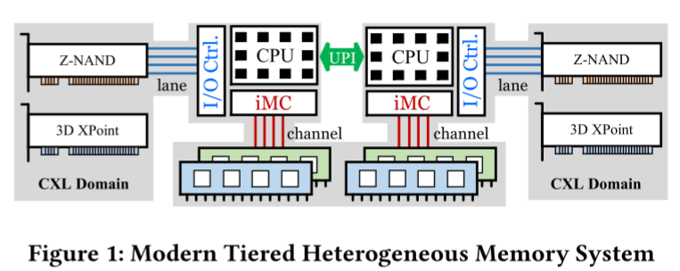
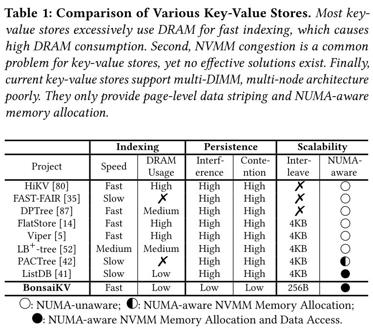
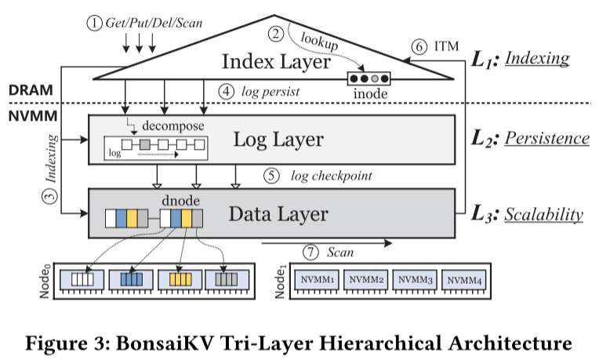
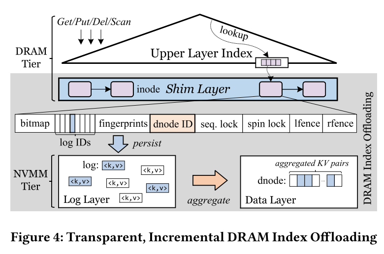

# BonsaiKV: Towards Fast, Scalable, and Persistent Key-Value Stores with Tiered, Heterogeneous Memory System

> VLDB 2023

新兴的基于NUMA/CXL的分层内存系统具有异构内存设备(如DRAM和NVMM)，可同时提供超快速度、大容量和数据持久性，为高性能内存键值存储提供了巨大的希望。为了充分释放此类内存系统的性能潜力，本文介绍了BonsaiKV，这是一种键值存储，可以充分利用分层内存系统中的不同组件。BonsaiKV的核心是一个三层分层存储架构，它将数据索引，持久性和可扩展性相互分离，并在专门的软件-硬件层中实现它们。我们设计BonsaiKV与一组新的技术，包括协作分层索引，NVMM拥塞控制机制，细粒度的数据条带化，和NUMA感知的数据管理，利用硬件的优势和解决设备的缺陷。我们使用各种YCSB工作负载将BonsaiKV与最先进的NVMM优化的键值存储和持久化索引结构进行比较。评估结果表明，BonsaiKV在读、写和扫描密集型场景中的性能分别高达7.69×、19.59×和12.86×。

---
layout: two-cols
---

## 面临挑战

1. DRAM快，但容量小，价格贵
2. NVM带宽小，多线程下容易饱和，导致流量拥塞
3. 分层DRAM-NVM存储器系统包含由通道隔离存储器模块组成的多个存储器节点，如何通过利用硬件提供的并行性和减轻远程存储器访问开销来扩展键值存储

::right::

## 本文贡献

1. 开发了一个分析模型来理解NVMM拥塞，然后提出了两种拥塞控制机制来减少流量干扰和缓解带宽争用
2. 设计了一个可扩展的细粒度数据条带方案，充分利用内存通道级并行
3. 提出了一种自适应KV数据复制机制和一种写最优数据一致性协议，以减轻远程内存访问开销

---
layout: two-cols
---

## 背景

1. NVM可以插在内存插槽中
2. CPU之间的连接构成了numa
3. 在CXL内存扩展中，设备被视为没有CPU内核的常规NUMA节点

::right::

## 和现有系统的比较

---
layout: two-cols
---

## Overview

1. 结合DRAM的高速和NVMM的大容量，以实现快速和内存高效的索引
2. 调整数据持久化粒度以解决NVMM拥塞
3. 充分利用通道级并行读数据
4. 通过本地化数据访问扩展到NUMA结构

- 对于所有请求(get/put/del/scan)，它们首先被发送到索引层(1)。
- 它首先在DRAM层(2)中找到相关联的索引条目。
- 然后，在NVMM层(3)中执行剩余的键值数据索引。它搜索存储在log或dnode中的目标数据。
- 对于put/del，他们在(4)中的日志层中创建新日志。删除请求在日志中有一个标记。
- 日志检查点线程将日志刷新到(5)中的数据层。
- 在键值数据从日志移动到dnode之后，修改DRAM层里的索引层(6)。
- 最后，存储在dnode中的键值的放置方案提供了上级访问并行性，支持快速扫描(7)。

::right::

---
layout: two-cols
---

## 索引层设计

- inode都存放在DRAM中
- Shim层(在内存中)中存放了最下面一层的inode，这层的inode结构与上层的不同
- Shim inode中，bitmap用于标识哪些log是有效的，log IDs可以存放16个logId，lfence和rfence表示节点的左右边界
- 当16个日志写满时，该Shim inode会分裂，但仍然指向同一个dnode
- 在checkpoint时日志会应用到dnode中。当Shim inode的日志空了，除了对应dnode左边界的inode，其他的inode都可以删除
- 点查时先从日志里找，找不到再从dnode里找。
- Shim inode中的fingerprints里存放了各条日志的key的hash(1B)，点查时只有fingerprint匹配了才需要去日志读取键值对

::right::

